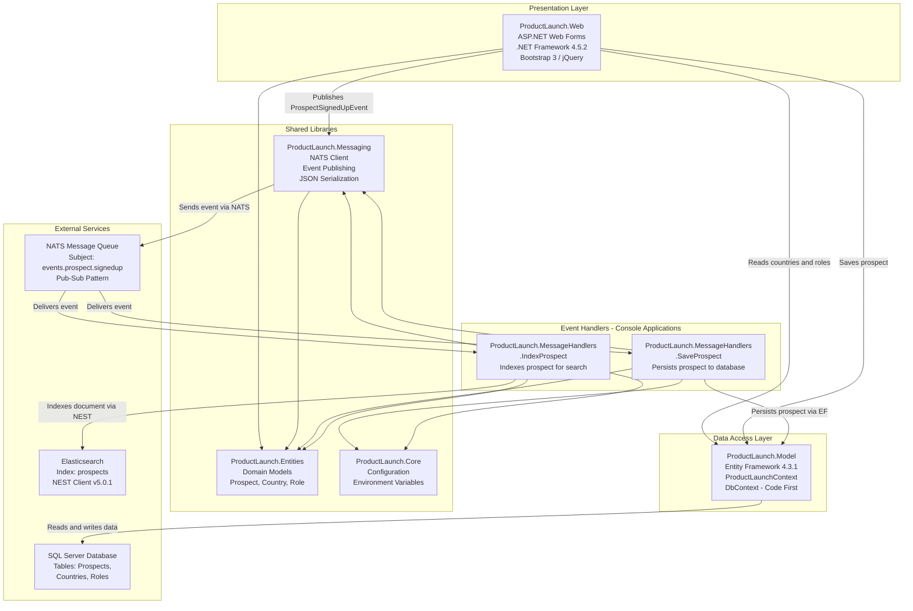

# Architecture Diagram

ProductLaunch is an event-driven .NET Framework 4.5.2 application with an ASP.NET Web Forms frontend, NATS messaging, SQL Server persistence, and Elasticsearch indexing.

## Application Architecture

