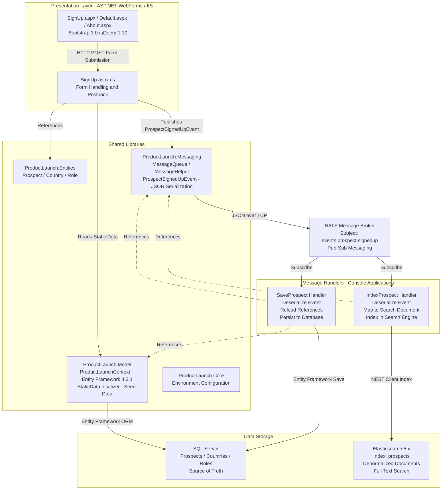

# Architecture Diagram

ProductLaunch is an event-driven .NET Framework 4.5.2 application with an ASP.NET WebForms frontend, NATS message broker for asynchronous processing, SQL Server for transactional storage, and Elasticsearch for search indexing.

## Application Architecture

